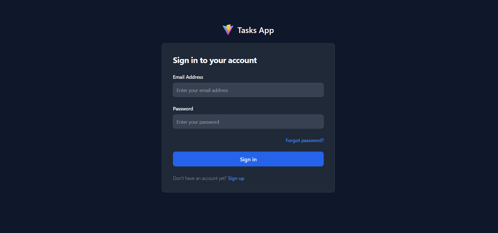
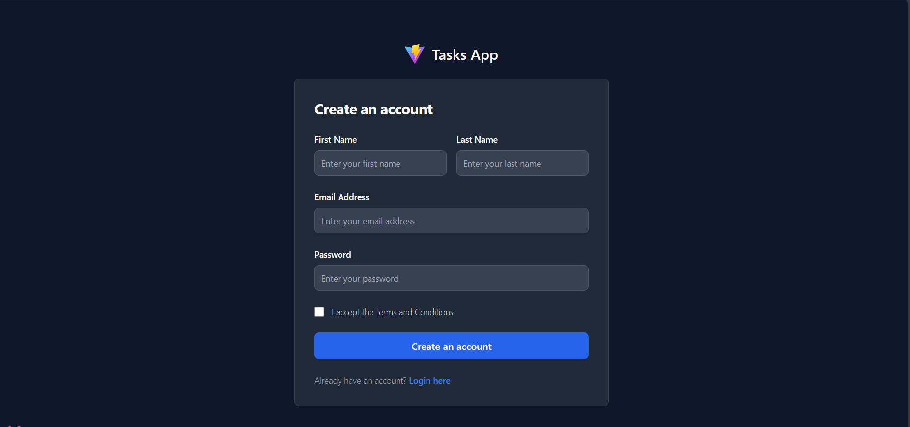
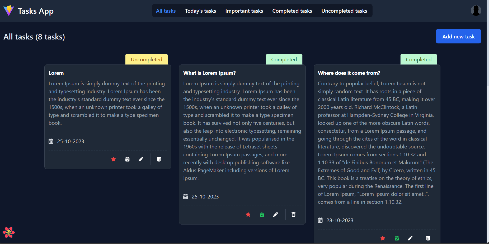

# FullStack Task Application

The purpose of this project is to demonstrate a fully functional FullStack Task Application keeping security in mind. The client-side, or frontend component, is developed using React.js while the server-side, or backend component, is built using Node.js.

<hr />





## Frontend (React + TypeScript + Vite + Tailwind CSS)
The project's organization aligns with established industry standards, employing a feature-based directory structure and maintaining a uniform naming convention. 

Additionally, the application employs the Context API and Hooks to effectively manage its state.

## Stacks:
- TypeScript
- Formik
- React Query
- Axios
- React cookie
- Yup
- Tailwind CSS
- React Router Dom
- Eslint
- Prettier

<hr>

### How to setup the Frontend part

- Clone the project and, in the terminal, navigate to the frontend directory. Then, run the following command to install all the dependencies needed for the project

```
npm run install:packages
```

- duplicate the .env.example file and rename the copy to .env file. Modify the variables as needed.

### How to run the project

- After installing the dependencies, you can go to the package.json file and click on the play button next to the 'dev' script under the scripts object.
- Alternatively, in the terminal, you can execute the following command:
-
```
npm run dev
```

<hr />

## Backend (Node + Express + Winston + TypeScript + JWT)

A tasks project backend api. It is design while keeping the different environments in the mind.

The project structure follows the best practices and conventions of a Node.js application.

The project has directories based on the functionality and type while justifying the directory name.

Following are the API features of this project:
- **TypeScript:** This backend is written in TypeScript, enhancing the development experience by adding static typing to JavaScript. This results in more reliable and maintainable codebases, helps catch potential errors during development, and provides better code completion and tooling support.
- **Request Limiter**: This feature prevents abuse or overload of the login route, forgot password route by limiting the number of requests, enhancing security and preventing potential attacks.
- **Centralized Error Handling:** Centralized error handling and response management streamline the codebase, making it easier to maintain and ensuring a consistent user experience.
- **API Versioning:** Implementing a versioning system for routes helps with organization and ensures compatibility when evolving the API, preventing breaking changes for existing clients.
- **Role-Based Access Control:** Role-based access control enhances security by granting or restricting permissions based on user roles, allowing fine-grained access management.
- **JWT Authentication:** JSON Web Tokens (JWT) are used for user authentication and authorization, adding a layer of security to the application by securely transmitting user data.
- **Password Reset via Email:** Functionality to send email notifications for password resets enhances user account security and recovery options.
- **MongoDB with Mongoose:** MongoDB is a NoSQL database that is fast and scalable, making it suitable for modern web applications. Mongoose is an ODM (Object-Document Mapper) for MongoDB that simplifies database interactions.
- **ESLint:** ESLint enforces coding standards and best practices, improving code quality and maintaining consistency while catching potential issues early in development.
- **Prettier:** Prettier automatically formats code according to predefined rules, ensuring a consistent code style throughout the project.
- **Cookies for Tokens**: Using cookies to store tokens information enhances user authentication and session management, providing a secure way to maintain user sessions.
- **Logging:** Winston is used for logging purposes, providing a robust and flexible logging solution that helps with debugging and monitoring the application.
- **Middleware for Exception Handling:** Middleware for handling exceptions within async Express routes and forwarding them to Express error handlers improves error management, ensuring the smooth operation of the application.

## API Stacks:
- Node.js
- Express.js
- Typescript
- Mongoose
- MongoDb
- Joi
- JWT
- Cookies
- Winston
- Rate Limiter
- Roles
- Nodemailer

## Setup MAILTRAP
To test the email functionality I've used the Mailtrap service: <a href="https://mailtrap.io/" target="_blank">Mailtrap</a>.
You can also create your credentials and place them in the .env file under the **Mailtrap(Email service) Info**.

## How to setup the backend part

- Clone the project and in the terminal of the server directory run the below cmd to install all the dependencies needed for the project or click on the play button next to it.

```
npm run install:packages
```

- Duplicate the file **.env.example** of a server and save a copy as **.env** in the server directory and change the variables according to your needs.

## How to run the backend part

After installing the dependencies either you can go to the package.json file of the server and click on the play button on script 'watch' under the scripts object or in the terminal you can write the below cmd or click on the play button next to it.

```
npm run watch
```

## Access the API at

```
http://localhost:3001/api/v1/
```

### Secrets

To generate a secret token and refresh to add in the .env file of the server you can open the terminal and run the below commands

```
node
```
```
require('crypto').randomBytes(64).toString('hex')
```

#### Server

- and click on the play button next to the 'watch' script under the scripts object.
- Alternatively, in the terminal, you can execute the following command:
- 
```
npm run watch
```
